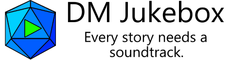

DM Jukebox is a program that helps dungeon / game masters manage the ambience, music, sound effects, and other audio during tabletop RPG games.
It works over your local speakers for in-person games, and over [Discord](https://discordapp.com/) for remote sessions using virtual tabletops like Roll20.
Unlike many other similar solutions, DM Jukebox lets you play audio directly from your own computer without having to download or stream audio from the Internet.
Whatever your party's setup is, wherever they are, this program is meant to help you breathe extra life into your adventures through the soundtrack.

## Current Status ##
*Last update: Dec 14, 2016*

DM Jukebox is currently in **ALPHA** development. It's not feature complete and is still being heavily iterated on every day. There's a long way to go still.

## How does it work? ##
The Jukebox works by letting you load files from your local hard drive into playlists or categories. The format doesn't matter, it can pretty much be anything under the sun - 
internally I use the amazing [FFmpeg](https://ffmpeg.org/) project to load / decode stuff, and it supports just about every format ever. You can even load videos and play
the audio directly from them if you were so inclined.

Once you have the files you want, you can play them over your speakers / over Discord for remote people to listen to. You can do one track at a time, or two, or five, or
eight hundred and forty-six... if you have an ambient wind sound and you want to combine it with sailors shouting and the sea splashing against the bow of your ship, you
can do that. Basically, here's a simple feature list:

 * Play any media files from your local computer (for videos, only the audio is used of course)
 * Play an unlimited number of tracks simultaneously
 * Enable Loop Mode on individual tracks that should repeat from the start when they finish
 * Control the volume of each track individually in case one is too loud or too soft compared to the others
 * Create playlists that automatically cycle to the next song when one finishes, and enable shuffle mode to randomize the order
 * Play the sound over your local speakers for in-person sessions, or over Discord for remote sessions

The best part? I'm a firm believer in open source software so the program is **completely free** and the source is openly available for you to use and tinker with.

## I'm not really into tabletop RPGs, can I use it for something else? ##
Sure! You can use it for anything that requires mixing multiple audio sources and playing them locally / over Discord. You could use it as a personal radio station for
your guild if you want, the program doesn't care. Let me know what creative uses you find for it!

## What do I need for it? ##
To run the program itself, you'll need [the latest version of the .NET Framework](https://www.microsoft.com/en-us/download/details.aspx?id=53345) (on Windows this is 4.6.2 at
the time this was written). For other OS's, stay tuned - I'm working on it.

If you want to develop / build from source, you'll probably want to grab [Visual Studio](https://www.visualstudio.com/post-download-vs/?sku=community&clcid=0x409&telem=ga)
(the Community Edition is probably fine, but if you have Pro / Enterprise with Update 3 then go with that of course).  

## How do I install it? ##
Once it's out of beta, I'll include an installer for the program and you just run it like you would any old installer. Right now, you either have to build it from source
or wait for me to start pushing binaries out.

## Do my other players need to do anything special? ##

Nothing special, the only thing remote players need is [Discord](https://discordapp.com/). 

## How can I help / contribute? ##
If you're a developer, then there's plenty of stuff to do. I'm not a frontend guy, so if you're proficient with UI / UX design and want to clean it up and make it snappier,
that would be a great way to start. If you know Mac / Linux UI frameworks that work with .NET like GTK# or something, you could go that route and help me build UIs for the
other operating systems. The core is designed to be cross-platform, but the UI itself is not.

If you're into backend development, take a look through the code and look for something you want that isn't there yet and implement it! Or look through the issue list,
find a bug that looks right up your alley, and help me squash it.

If you're not a developer, just keep on using DM Jukebox and report those errors when they show up. I can't fix something if I don't know that it's busted... so that's where
you come in. Other than that, spread the word! If you like the app, share it with some of your other fellow DMs to try out. The more people that use it, the more feedback
I get and the better I can make it.

### Either way, the most important thing you can do is talk to me and give me feedback! ### 
If you like something about it, tell me. If you don't like something about it, tell me that too!
People tend to stay silent when they're happy with something, but please let me know if you're enjoying the program. It really helps motivate me to work on this if I
know you're getting some use out of it.

## I want to support the project. Do you accept donations? ##
I'm seriously touched by the sentiment. Honestly. Thank you so much for even considering it! However, I'm not looking for donations or anything. 
I'm doing just fine and simply want to help this amazing community of storytellers, worldbuilders and adventurers bring their fantasies to life.
If you really want to show your support, take whatever you would have given me and donate it to your favorite charity. If you don't have one, here
are a few of mine:

* [Wikipedia](https://donate.wikimedia.org/wiki/WMFJA1/en/US)
* [The Planetary Society](https://secure.planetary.org/site/SPageNavigator/supportprojects.html)
* [Electronic Frontier Foundation](https://supporters.eff.org/donate/button)
* [Seafood Watch](https://www.seafoodwatch.org/support-seafood-watch)

## Thanks for your interest, development is constantly ongoing so check back often for updates! ##